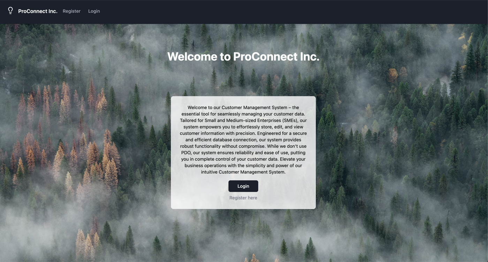
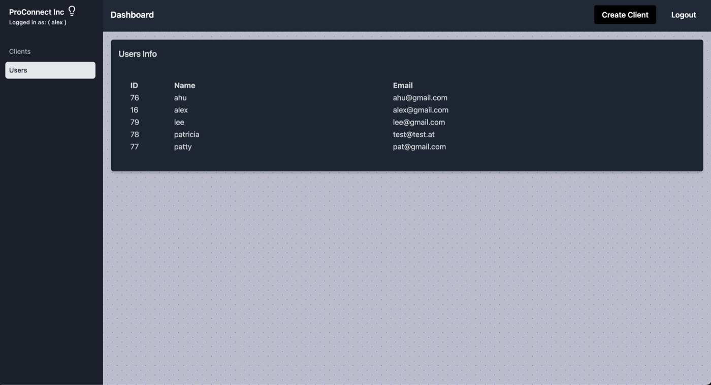
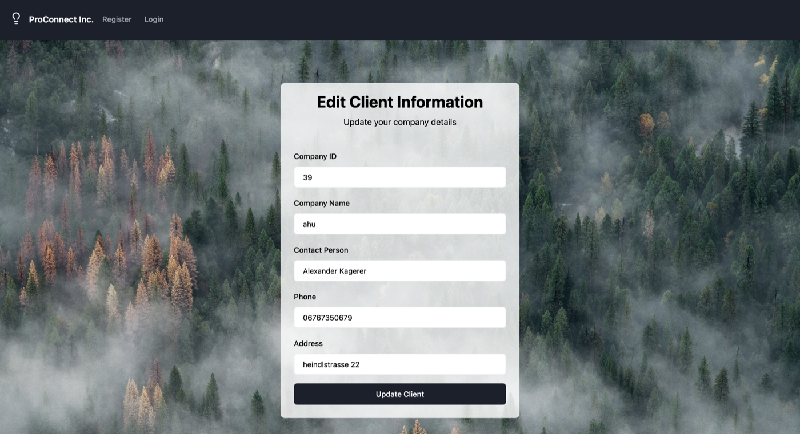
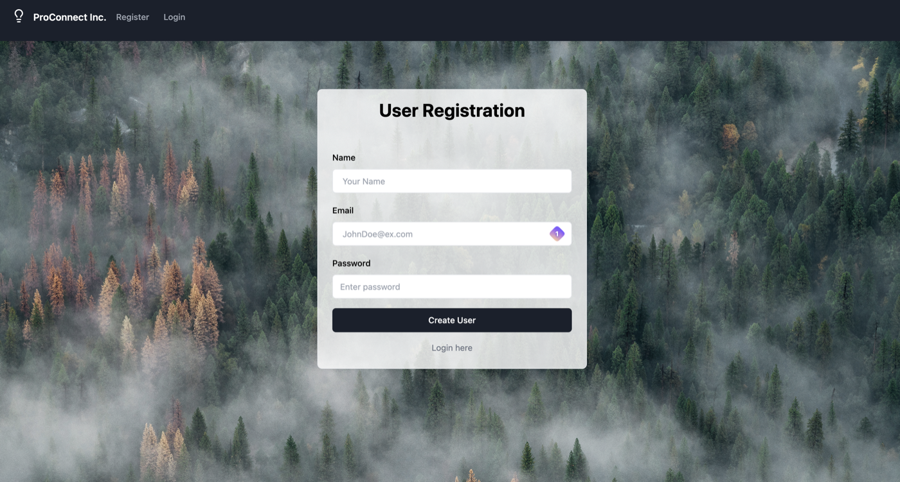
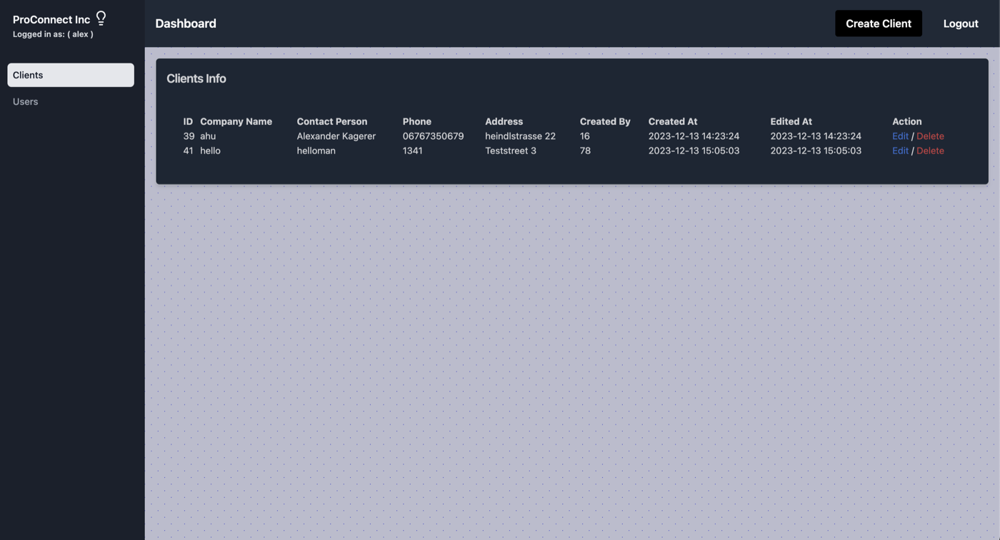

# Customer Management System






This is a small PHP project developed as a final exercise for a bootcamp. It aims to create a customer management system for a Small and Medium-sized Enterprise (SME) to manage their customer data efficiently.

## Objective

The objective of this project is to develop a system that allows SMEs to register customers, store their data in a database, and provide functionalities to edit and view customer entries.

## Features

- User registration
- User login
- Creation of new customers via a contact form
- Overview of all customers
- Ability to edit and delete each customer entry
- User-specific access: Logged-in users can only edit or delete the entries they have created
- Responsive design for user interface

## Requirements

### Database Structure:

- `users`: user_id, name, email, password
- `clients`: company_id, company_name, contact_person, phone, address, created_by (user who created the entry), created_at (creation date), edited_at (modification date)
- Relation: One user can have multiple clients

### User Interface:

- Utilize a CSS framework for styling (Tailwind)
- Ensure user-friendly design with clear feedback on form submission and error handling
- Make use of responsive design principles for cross-device compatibility

## Technologies Used

- PHP
- PDO with SQLite
- Docker
- CSS framework (Tailwind)
- HTML
- JS

## Live Demo

**<your-render-url>** (free tier: first load may take ~30s)

Demo login: `demo@example.com` / `demo1234`. Data resets whenever the server restarts.

## Run locally

With Docker:

```bash
docker build -t sme . && docker run -p 8080:80 sme
```

Or with PHP 8 (pdo_sqlite):

```bash
DB_PATH=/tmp/sme.sqlite php db/seed.php
DB_PATH=/tmp/sme.sqlite php -S localhost:8080
```

The database is SQLite (`db/schema.sql`), seeded with demo data by `db/seed.php`.

## Deploy

Push to GitHub, then create a Render Web Service (Docker runtime, free plan) from the repo. `render.yaml` is included.

## Credits

This project was developed by Alexander Kagerer as a final exercise for my software development bootcamp.

## License

This project is licensed under the [License Name] License - see the [LICENSE](LICENSE) file for details.
